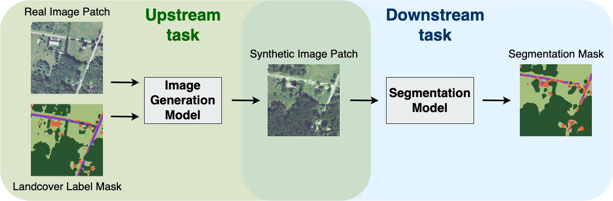

# Label-conditional Synthetic Satellite Imagery
Welcome to the Label-conditional Synthetic Satellite Imagery project repository ([our paper](https://arxiv.org/abs/2302.04305)), where you will find all the necessary codes, scripts, and documents for generating synthetic satellite images and conducting downstream experiments.

<p align="center">
    <br/>
    <b>Figure 1.</b> The pipeline of generating and evaluating synthetic satellite imagery.
</p>

## Setup

### Code
Use the following commands to clone this repository:

```
git clone https://github.com/ms-synthetic-satellite-image/synthetic-satellite-imagery.git
```

### Data Source
We train our label-conditional image generation model and generate synthetic images on [Chesapeake Land Cover Dataset](https://lila.science/datasets/chesapeakelandcover). We use the 4-channel high-resolution aerial imagery, the high-resolution land cover labels from the Chesapeake Conservancy, and restrict our study area to Maryland.

Use the following commands to download the train, validation and test tiles from the data source.

```
bash get_data.sh [data folder] [split] [os]
```
where `[split]` can be chosen from `train`, `val` or `test`, and `[os]` can be chosen from `linux` or `mac`.

For example:
```
bash get_data.sh data_chesapeakeiclr train linux
bash get_data.sh data_chesapeakeiclr val linux
bash get_data.sh data_chesapeakeiclr test linux
```

Then use the following command to replace `spatial_index.geojson` in the data folder.
```
cp spatial_index.geojson data_chesapeakeiclr/spatial_index.geojson
```
### Environment
We perform all our experiments on 
Standard NC12 virtual machines with `ubuntu-2004` os published on Microsoft Azure. We adapt the environment requirements from [torchgeo](https://github.com/microsoft/torchgeo) and [SPADE](https://github.com/nvlabs/spade/#installation).

Use the following commands to install and activate the environment.

```
conda env create -f environment.yml
conda activate satellite_iclr
pip install -r requirements.txt
```


## Generate Synthetic Satellite Imagery

We use a pretrained SPADE model to generate the synthetic satellite images, which will be used in the downstream experiments.

### Steps

1. Go to `generate_synthetic` folder

2. Download model weights from this [folder](https://drive.google.com/drive/folders/11C1qxiOcIur7rWcom1odeCSQJ7g2sjmz) and place it in `generatate_synthetic/checkpoints/`

3. To generate synthetic images for the training set to use in downstream experiments, run `python inference.py --data_folder [train_data_folder] --data_type train --spade_model [spade_model] --no_output [no_output] --gpu_id [gpu_id]` where `train_data_folder` is the path to Maryland training data, `spade_model` refers to name of model (`lambda_0`, `lambda_2`, ...), `no_output` is number of synthetic image generated, and `gpu_id` is the gpu to run the model on.

For example:
```
python inference.py --data_folder ../data_chesapeakeiclr/md_1m_2013_extended-debuffered-train_tiles --data_type train --spade_model lambda_0 --no_output 1 --gpu_id 0
```

4. To generate synthetic images and evaluate FID scores over the test set, run `python inference.py --data_folder [test_data_folder] --data_type test --spade_model [spade_model] --save_patch 1 --compute_fid 1 --gpu_id [gpu_id]`.

For example:
```
python inference.py --data_folder ../data_chesapeakeiclr/md_1m_2013_extended-debuffered-test_tiles --data_type test --spade_model lambda_0 --save_patch 1 --compute_fid 1 --gpu_id 0
```


## Downstream Segmentation
To test the usability of the synthetic satellite images generated by our upstream label-conditional image generation model, we are interested in comparing the performance of using this synthetic imagery to train downstream machine learning models to that of using real imagery. In this work, we focus on the segmentation task. By training a multi-label
segmentation task on datasets with different proportions of different diversity synthetic images mixed with real images, we show that our synthetic satellite imagery could work as a substitute or augmentation for real datasets to build comparable downstream machine learning models.

### Steps

1. Go to `downstream_segmentation` folder

2. To train a model with a specified diversity value and mix rate:

```
python train.py --name [model name] --mix_rate [mix rate] --lambda_diverse [diversity]
```
where `name` is an identifier of the model checkpoint; `mix_rate` either ranges from 0.0 to 1.0, or equals 2.0 or 3.0; `diversity` is an integer from 0 to 10.

3. To evaluate a trained downstream model:

```
python evaluation.py --model_path [path to a model checkpoint from step 2]
```
